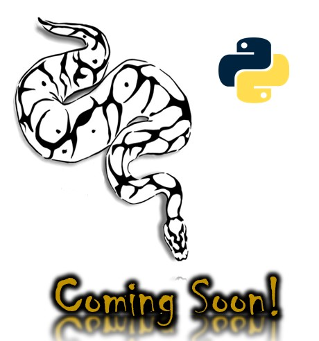

# ColdFusion

  
    
  
   
  
   
  
   
  
   
  
  
  ## Description
  
   TBD
 
  ## Table of Contents
  - [Description](#description)
  - [Installation](#installation)
  - [Documentation](#documentation)
  - [Usage](#usage)
  - [Screenshot](#screenshot)
  - [Features](#features)
  - [Acknowledgements](#acknowledgements)
  - [License](#license)
  - [Testing](#testing)
  - [Contact](#contact)

  ## Installation

 DOWNLOAD ADOBE COLDFUSION FREE TRIAL | ADOBE COLDFUSION (2021 RELEASE) <https://www.adobe.com/in/products/coldfusion/download-trial/try.html>
  
 Install the ColdFusion Builder plug-in configuration <https://www.adobe.com/go/learn_cfu_cfbuilder_en>

  ## Documentation
   Installation instructions <https://helpx.adobe.com/in/coldfusion/installing-coldfusion-builder.html>
    
   Getting started with ColdFusion <https://helpx.adobe.com/in/coldfusion/getting-started-coldfusion.html>
  ## Usage
  Exploring DSLs (Domain-Specific Language) / LOP (Language Oriented Programming) using ColdFusion

  ## Screenshot
  

  ## Features
  TBD
  
  # Acknowledgements
  Rob Atalla
    
  ## License
  
   
  Permission to use this application is granted under the Apache License 2.0. <https://opensource.org/licenses/apache>

  ## Testing
  TBD

  ## Contact:
  Holler at me! <a href="mailto:rob.atalla@robatalla816.com">rob.atalla@robatalla816.com</a>